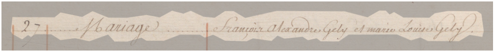
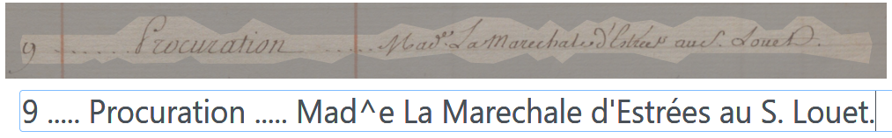
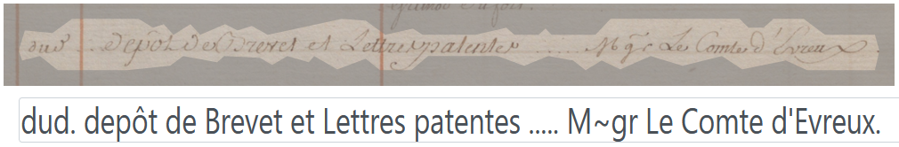
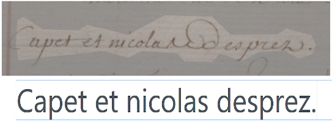

# lectaurep-bronod

<!--
badges HUMGenerator -->

## Contexte de production 

Le projet [LECTAUREP](https://lectaurep.hypotheses.org/) (LECTure Automatique de REPertoires), qui a débuté en 2018, est une initiative conjointe du Minutier central des notaires de Paris des Archives Nationales, de l’équipe ALMAnaCH (Automatic Language Modeling and Analysis &amp; Computational Humanities) à Inria et de l’EPHE (Ecole Pratique des Hautes Etudes), en partenariat avec le Ministère de la Culture.

Le projet vise à repenser l’utilisation actuellement faite des registres des actes notariés, l’une des sources historiques les plus consultées aux Archives nationales, par les chercheurs et les utilisateurs des fonds d’archives notariales. Pour ce faire, le projet a instaurer un workflow de traitement de ces manuscrits à l’aide de la reconnaissance automatique des documents manuscrits (HTR) et d'extraction d’information (NER) en adoptant notamment l'application eScriptorium pour produire la vérité de terrain, entraîner des modèles de reconnaissance et corriger les transcriptions résultants.

Le corpus `lectaurep-bronod` rassemble 100 pages issues du répertoire de Maître Louis Bronod (1719-1765), notaire à Paris du 13 décembre 1719 au 23 juillet 1765. Les pages concernées ont été rédigés au cours des années 1742 à 1745.

:arrow_right: voir la [fiche détaillée de Louis Bronod](https://www.siv.archives-nationales.culture.gouv.fr/siv/rechercheconsultation/consultation/producteur/consultationProducteur.action?formCallerNP=PRODUCTEUR&formCallerIR=&notProdId=FRAN_NP_013066)

## Règles de transcription

- bien que suivant une structure tabulaire, les segments ont été tracés en continu, ligne par ligne. Une série de ` ..... `, présente sur l'image, signale le changement de colonne. 

- le texte suscrit a été signalé par un `^` liminaire. Le phénomène "**Made**" (Madame) est donc transcrit par "Mad^e".

- les symboles d'abréviation, en particulier les `~` ont été conservés. Le phénomène "**Mğr**" (Monseigneur) est donc transcrit par "M\~gr".

- l'emploi des minuscules et majuscule a été respecté.

<!--- les s longs ont été transcrits par des `s` simples.-->

## Les autres dépôts LECTAUREP

➡️ [Lectaurep-repertoires](https://github.com/HTR-United/lectaurep-repertoires)
<!--
➡️ [Lectaurep-bronod](https://github.com/HTR-United/lectaurep-bronod) -->

➡️ [Lectaurep-mariages-et-divorces](https://github.com/HTR-United/lectaurep-mariages-et-divorces)

---

<!-- logo institutionnels -->

| Inria                               | Archives nationales                                             |
| :---------------------------------: | :-------------------------------------------------------------: |
|  |  |

